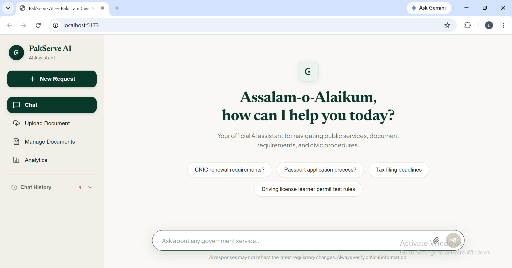
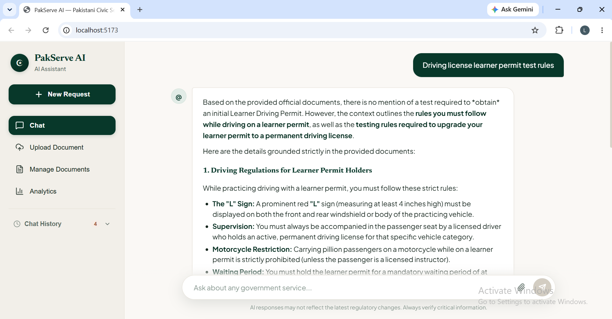
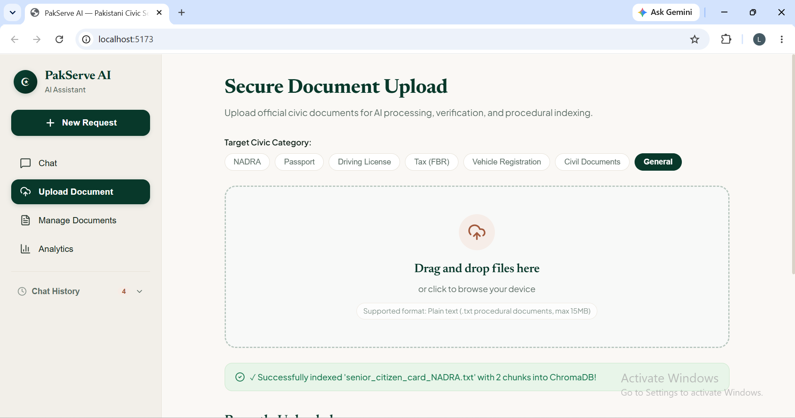
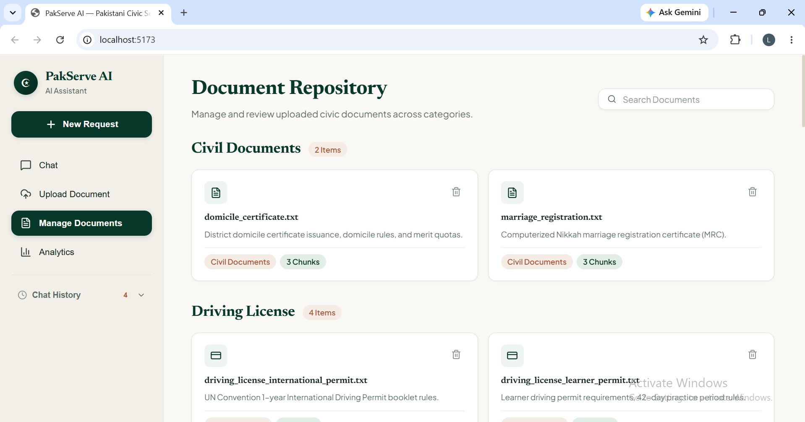
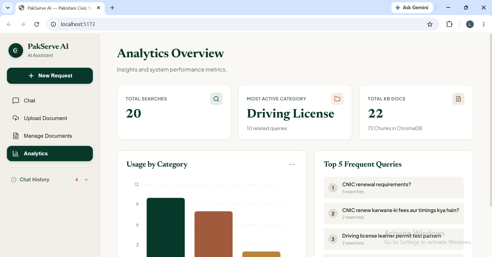
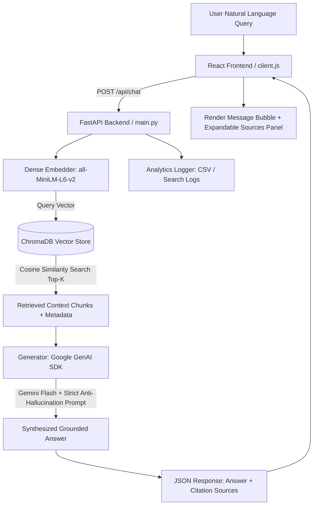

# 🇵🇰 PakServe AI — Grounded Civic Procedural Assistant

<div align="center">



[](https://fastapi.tiangolo.com)
[](https://react.dev)
[](https://vitejs.dev)
[](https://www.trychroma.com)
[](https://ai.google.dev)
[](https://huggingface.co/sentence-transformers/all-MiniLM-L6-v2)

**An intelligent, strictly-grounded Retrieval-Augmented Generation (RAG) assistant for navigating Pakistani public services, citizen documentation, and civic procedures.**

[🎥 Video Demo](#-video-demo) • [✨ Key Features](#-key-features) • [🖼️ Screenshots](#-screenshots--walkthrough) • [🏗️ Architecture](#-system-architecture) • [🚀 Quickstart](#-quickstart-guide) • [📡 API Reference](#-api-endpoints)

</div>

---

## 📌 Executive Summary

Navigating Pakistani government services (NADRA CNIC renewal, Machine-Readable Passports, DLIMS Driving Licenses, FBR Active Taxpayer list filing, Excise Vehicle Transfers, and Union Council civil records) is often frustrating due to fragmented procedural info, outdated unofficial blogs, and bureaucratic jargon.

**PakServe AI** solves this with a **zero-hallucination RAG architecture**:
1. It ingests verified official procedural documentation into a high-performance vector store (**ChromaDB** with `all-MiniLM-L6-v2` dense embeddings).
2. It answers natural-language questions in **English, Urdu, and Roman Urdu**.
3. It enforces strict **grounding constraints via Google Gemini Flash** — if an answer is not in verified official records, it strictly refuses to speculate.
4. It provides complete transparency with **interactive Source Citations** and confidence relevance scoring.
5. It features a **custom editorial UI** (warm cream `#FAF8F5`, deep civic green `#08382A`, and terracotta accents) built with React + Vite.

---

## 🎥 Video Demo

Check out the full end-to-end walkthrough video demonstrating real-time RAG querying, document upload, repository management, and search analytics:

▶️ **[Watch the Walkthrough Demo Video (MP4)](demo/PakServe%20AI.mp4)**

> *The demo video file is available locally in the [`demo/`](demo/PakServe%20AI.mp4) directory.*

---

## 🖼️ Screenshots & Walkthrough

### 1. Main Conversational Interface (Hero & Suggestions)
*Warm editorial aesthetic with verified suggestion chips and collapsible Chat History drawer.*


---

### 2. Grounded AI Response with Anti-Hallucination
*Structured procedural steps, required documents checklist, bold headings, and collapsible source citations.*


---

### 3. Secure Document Upload & Instant Indexing
*Drag-and-drop plain text (.txt) procedural documents with category tagging, automatic chunking (300 words, 50-word overlap), vector embedding, and ChromaDB persistence.*


---

### 4. Document Repository Management
*Categorized grid of ingested documents with chunk counts, live search filter, and safe deletion confirmation overlay.*


---

### 5. Real-time Search Analytics Dashboard
*Total search volume, most active civic categories, ChromaDB collection metrics, category usage bar chart (Recharts), and ranked top frequent queries.*


---

## ✨ Key Features

- **🛡️ Strict Anti-Hallucination & Grounding**: The Gemini prompt strictly restricts answers to retrieved chunks. It never invents government fees, processing days, or required proofs.
- **🌐 Multilingual & Roman Urdu Support**: Handles queries in Standard English, Urdu, and Roman Urdu (e.g., *"CNIC renew karwane ke liye kya documents chahiye?"*).
- **📑 Verifiable Source Citations**: Each AI response includes a collapsible `Sources (N)` panel displaying document names, category tags, relevance match percentages, and matched text excerpts.
- **💾 Session Persistence & Chat History**: Conversations persist locally. Clicking `+ New Request` archives past chats into a collapsible sidebar drawer for easy restoration.
- **⚡ In-Memory & File Ingestion**: Upload new procedural manuals or policies directly from the browser; the pipeline automatically chunks, embeds, and updates the vector database in real-time.
- **📊 Real-time Search Analytics**: Logs user search activity to persistent storage and aggregates usage patterns, top queries, and domain demand.
- **🎨 Custom Design System**: Custom-designed UI avoiding generic templates — featuring `Newsreader` editorial serif typography, `Plus Jakarta Sans`, and a warm civic color palette.

---

## 🏛️ Knowledge Base Domains

PakServe AI comes pre-loaded with **24 comprehensive procedural documents** (72 vector chunks) covering:

| Category | Topics Covered |
|---|---|
| **NADRA** | Fresh CNIC, CNIC Renewal, CNIC Modification, Child Registration Certificate (B-Form), Family Registration Certificate (FRC), Senior Citizen Cards |
| **Passport** | First-time MRP Application, Online & In-person Passport Renewal, Lost/Damaged Passport Replacement, Urgent & Fast-Track Fee Schedules |
| **Driving License (DLIMS)** | Learner Driving Permit, Permanent License (Sign Test & Field Track), License Renewal & Grace Periods, International Driving Permits (IDP) |
| **Tax & Revenue (FBR)** | Free 13-digit NTN Registration (IRIS 2.0), Salaried Individual Annual Tax Return & Wealth Statement, Business & Freelancer Export Returns, Late Filing Penalties & ATL Surcharges |
| **Vehicle Registration** | New Motor Vehicle Registration, Biometric Ownership Transfer, Universal Computerized Number Plates |
| **Civil Documents** | Union Council NADRA Birth Registration, Computerized Marriage Registration Certificate (MRC / Nikkah), District Domicile & PRC Issuance |
| **General FAQs** | Mega Center Operating Hours, Token Queue Systems, 1Link PSID Government Fee Payment Guidelines |

---

## 🏗️ System Architecture



---

## 🛠️ Technology Stack

### Backend
- **Framework**: [FastAPI](https://fastapi.tiangolo.com/) (Python 3.10+)
- **Server**: [Uvicorn](https://www.uvicorn.org/) ASGI Server
- **Vector Database**: [ChromaDB](https://www.trychroma.com/) (Persistent Cosine Distance)
- **Embeddings**: [Sentence-Transformers](https://www.sbert.net/) (`all-MiniLM-L6-v2`, 384-dimensional dense vectors)
- **LLM Synthesis**: [Google GenAI SDK](https://ai.google.dev/) (`google-genai` with `gemini-3.7-flash` / `gemini-2.5-flash`)
- **Data Analysis**: Pandas, Python-Dotenv

### Frontend
- **Framework**: [React 18](https://react.dev/) + [Vite](https://vitejs.dev/)
- **Styling**: Vanilla CSS Design Tokens (Custom Theme System in `theme.css`)
- **Visualizations**: [Recharts](https://recharts.org/) (Custom Palette Responsive Bar Charts)
- **Icons**: [Lucide React](https://lucide.dev/)
- **Typography**: Google Fonts (`Newsreader` Serif & `Plus Jakarta Sans`)

---

## 🚀 Quickstart Guide

### Prerequisites
- Python 3.10 or higher
- Node.js 18+ and npm
- Google Gemini API Key ([Get a free key from Google AI Studio](https://aistudio.google.com/))

---

### Step 1: Clone the Repository
```bash
git clone https://github.com/your-username/pakserve-ai.git
cd pakserve-ai
```

---

### Step 2: Backend Configuration & Setup

1. Navigate to `backend/` and create a virtual environment:
   ```bash
   cd backend
   python -m venv venv
   
   # Windows:
   venv\Scripts\activate
   # macOS/Linux:
   source venv/bin/activate
   ```

2. Install backend dependencies:
   ```bash
   pip install -r requirements.txt
   ```

3. Configure your environment variables:
   Create a `.env` file in the `backend/` folder:
   ```env
   GEMINI_API_KEY=your_actual_gemini_api_key_here
   ```

4. *(Optional)* Ingest or re-index the initial knowledge base:
   ```bash
   python src/ingest.py
   ```

5. Start the FastAPI server:
   ```bash
   python -m uvicorn main:app --host 0.0.0.0 --port 8000 --reload
   ```
   *The backend will be live at `http://localhost:8000` (Swagger docs at `http://localhost:8000/docs`).*

---

### Step 3: Frontend Setup

1. Open a new terminal tab, navigate to `frontend/`:
   ```bash
   cd frontend
   npm install
   ```

2. Start the Vite development server:
   ```bash
   npm run dev
   ```
   *The frontend will be accessible at `http://localhost:5173`.*

---

## 📡 API Endpoints

| Method | Endpoint | Description | Request / Response |
|---|---|---|---|
| `GET` | `/` | Health Check | Returns service status and API version |
| `POST` | `/api/chat` | Main RAG Query | Body: `{ "query": "string", "category_filter": "string" }`<br>Returns: `{ "answer": "...", "sources": [...] }` |
| `POST` | `/api/documents/upload` | Multipart File Upload | `multipart/form-data` with `.txt` file & optional category.<br>Chunks, embeds, and indexes into ChromaDB. |
| `GET` | `/api/documents` | List Ingested Documents | Returns array of documents with category and chunk count |
| `DELETE` | `/api/documents/{doc_name}` | Delete Document | Removes all document chunks from ChromaDB and file disk |
| `GET` | `/api/analytics` | Analytics Aggregation | Returns total searches, top frequent queries, category usage breakdown |

---

## 🧪 Testing Suite

PakServe AI includes automated test scripts to verify every layer of the pipeline:

```bash
# 1. Test Chunking & ChromaDB Retrieval Pipeline
python backend/test_retrieval.py

# 2. Test Gemini LLM Grounding & Refusal Logic
python backend/test_generator.py

# 3. Test Full REST API Endpoints End-to-End
python backend/test_api.py
```

---

## 📂 Project Structure

```
PakServe AI/
├── backend/
│   ├── data/
│   │   ├── documents/          # 24 verified procedural .txt documents
│   │   └── search_logs.csv     # Persistent search analytics log
│   ├── chroma_db/              # Persistent ChromaDB vector storage
│   ├── src/
│   │   ├── chunker.py          # Word-based sliding window chunking
│   │   ├── embedder.py         # all-MiniLM-L6-v2 dense embeddings
│   │   ├── vector_store.py     # ChromaDB collection CRUD & similarity search
│   │   ├── generator.py        # Gemini Flash API grounding & prompt engineering
│   │   ├── analytics.py        # Search logger and metric aggregations
│   │   └── ingest.py           # Bulk knowledge base ingestion utility
│   ├── main.py                 # FastAPI REST API with CORS middleware
│   ├── requirements.txt        # Python package dependencies
│   └── .env                    # GEMINI_API_KEY (git-ignored)
│
├── frontend/
│   ├── src/
│   │   ├── api/
│   │   │   └── client.js       # Fetch client connecting to FastAPI backend
│   │   ├── components/
│   │   │   ├── Sidebar.jsx     # Navigation and Chat History drawer
│   │   │   ├── ChatWindow.jsx  # Main conversational view & floating input
│   │   │   ├── MessageBubble.jsx # Formatted AI markdown & user bubbles
│   │   │   ├── SourcesPanel.jsx # Collapsible source citation cards
│   │   │   ├── UploadPanel.jsx # Drag-and-drop document upload interface
│   │   │   ├── ManagePanel.jsx # Categorized document repository with delete overlay
│   │   │   └── AnalyticsPanel.jsx # Recharts bar chart & top search metrics
│   │   ├── styles/
│   │   │   └── theme.css       # Core design system tokens & colors
│   │   ├── App.jsx             # Top-level routing & chat persistence
│   │   └── main.jsx            # React root entry point
│   ├── package.json            # Node dependencies (recharts, lucide-react)
│   └── vite.config.js          # Vite build configuration
│
├── demo/
│   └── PakServe AI.mp4         # Complete video demonstration
├── screenshots/                # Application UI screenshots (1.png - 5.png)
├── CLAUDE.md                   # Complete architectural specification & blueprint
├── .gitignore                  # Git ignore rules
└── README.md                   # Project documentation
```

---

## ⚠️ Limitations & Disclaimers

> **Disclaimer**: *The procedural guidelines and fee schedules indexed in this knowledge base are illustrative and compiled for demonstration and educational purposes. Pakistani government departments frequently update official fees, online portal interfaces, and regulatory documentation requirements. Citizens are always advised to verify critical procedural details with official departmental portals (e.g. [nadra.gov.pk](https://www.nadra.gov.pk), [dgip.gov.pk](https://www.dgip.gov.pk), [fbr.gov.pk](https://www.fbr.gov.pk)).*

---

## 📄 License

This project is open source and available under the [MIT License](LICENSE).

---
## Laiba Usman
